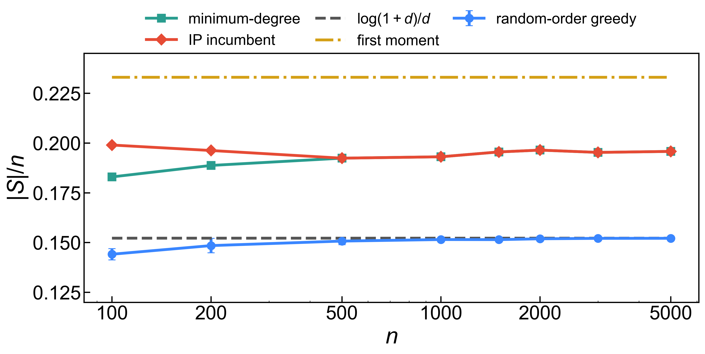
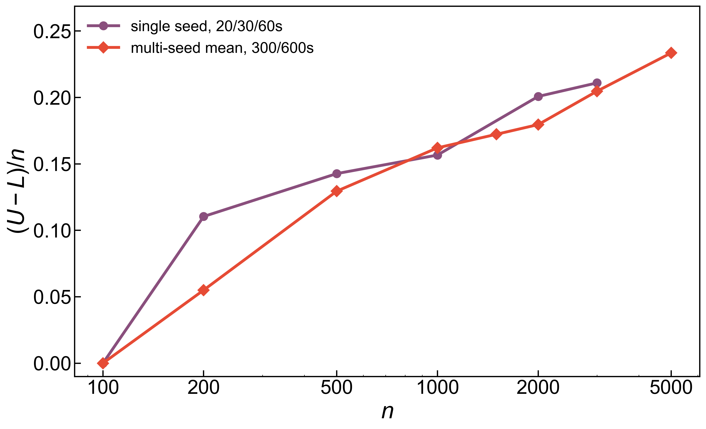
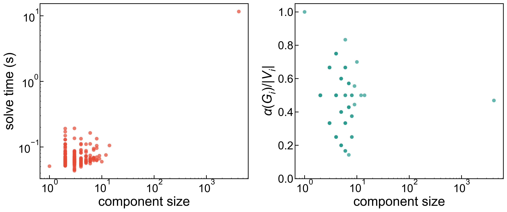

# Integer Programming for Maximum Independent Set

Computational final project for 6.265/15.070/18.619, Spring 2026.

This project studies maximum independent sets in sparse Erdős-Rényi graphs
`G(n,d/n)` and in the SNAP ca-GrQc collaboration network. The notebook compares
*random-order greedy*, *minimum-degree greedy*, and *a warm-started CBC integer
program*. It reports feasible incumbents separately from certified optima.

## Main Results

- For `G(n,20/n)`, random-order greedy tracks the finite-`d` scale
  `log(1+d)n/d`.
- The warm-started IP pipeline returns feasible independent sets above the
  random-order greedy scale throughout a multi-seed random-graph experiment
  covering `n=100` through `n=5000`.
- CBC certifies optimality for all 20 `n=100` seeds in that experiment; every
  larger random instance ends without a matching upper bound.
- For SNAP ca-GrQc, solving by connected component proves
  `alpha(G) = 2459`; minimum-degree greedy finds 2458.
- A matched Erdős-Rényi control with the same `n` and expected average degree is
  harder to certify under the same IP formulation.

## Figures

**Random graph feasible sets.** The main random-graph experiment averages over
multiple seeds, with 100 random-order greedy permutations per instance.



**Certificate gap.** A shorter single-seed run and the larger multi-seed run
show the same qualitative pattern: more time reduces the gap, but the larger
random graphs still remain uncertified.



**Component profile.** Component decomposition is what makes the ca-GrQc exact
solve tractable.



## Files

- `final_project_1.ipynb` - self-contained executable notebook.
- `writeup.pdf` - final PDF report.
- `writeup.tex` - LaTeX source for the report.
- `results/*.csv` - cached experiment outputs used by the notebook/report.
- `results/long_batch/er_long_results.csv` - multi-seed random-graph cache.
- `results/long_batch/long_batch_summary.csv` - aggregate table generated by
  the notebook.
- `results/figure*.pdf` and `results/figure*.png` - generated figures.
- `data/ca-GrQc.txt.gz` - cached SNAP data file.
- `requirements.txt` - Python dependencies.

## Reproduce

```bash
python3 -m venv .venv
.venv/bin/python -m pip install -r requirements.txt
.venv/bin/python -m ipykernel install --user --name final_project_1 --display-name "Python (final_project_1)"
```

Open `final_project_1.ipynb` with the `Python (final_project_1)` kernel. By
default, the notebook uses the cached completed multi-seed results and
regenerates the summary table and figures.

To rebuild the report PDF from LaTeX:

```bash
latexmk -pdf writeup.tex
```

## Notes

Re-executing the notebook reloads the cached multi-seed results, rebuilds the
summary table, and regenerates the report figures.
