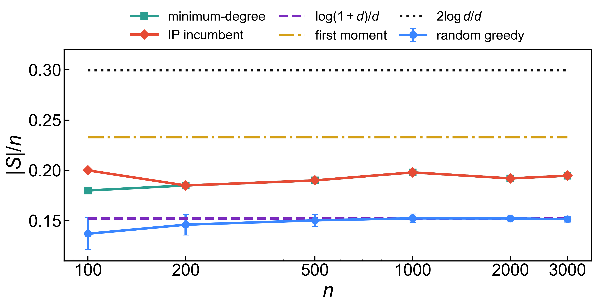
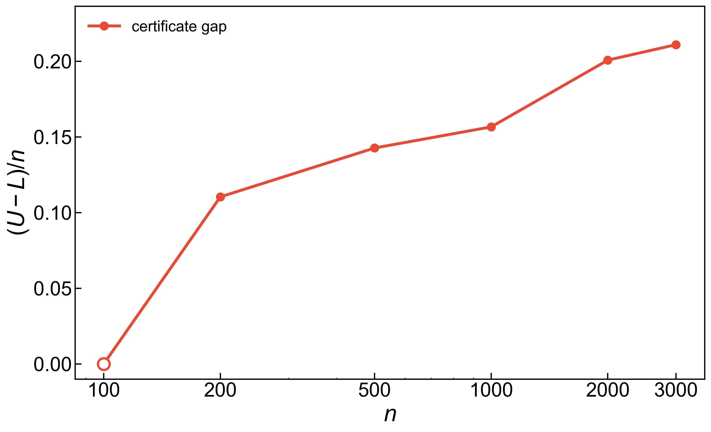
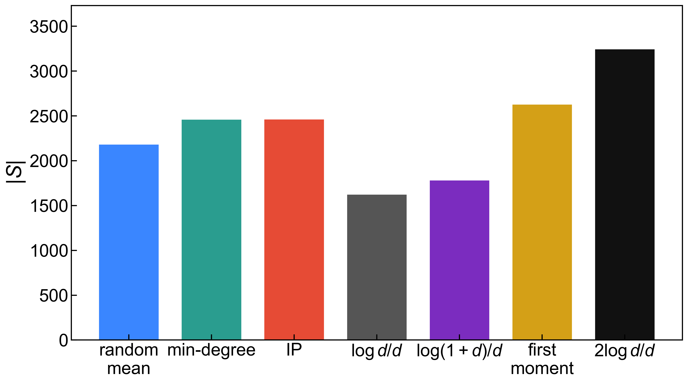

# Integer Programming for Maximum Independent Set

Computational final project for 6.265/15.070/18.619, Spring 2026.

This project studies maximum independent sets in sparse Erdős-Rényi graphs
`G(n,d/n)` and in the SNAP ca-GrQc collaboration network. The notebook compares
*random-order greedy*, *minimum-degree greedy*, and *a warm-started CBC integer
program*, together with careful separation between *feasible incumbents* and *certified
optima*.

## Main Results

- For `G(n,20/n)`, random-order greedy tracks the finite-`d` scale
  `log(1+d)n/d`.
- The warm-started IP pipeline returns feasible independent sets above the
  random-order greedy scale through `n=3000`.
- CBC certifies optimality only on the smallest random instance in the completed
  short grid; larger instances are limited by certificate gaps.
- For SNAP ca-GrQc, solving by connected component proves
  `alpha(G) = 2459`; minimum-degree greedy finds 2458.
- A matched Erdős-Rényi control with the same `n` and expected average degree is
  harder to certify under the same short time limit.

## Figures

**Sparse random graphs.** Independent set densities for `G(n,20/n)` compared
with the finite-`d` greedy scale, first-moment benchmark, and large-`d`
asymptotic reference.



**Certification gap.** CBC returns strong feasible incumbents after warm starts,
but the upper-bound certificate remains loose on larger random instances.



**Real network comparison.** ca-GrQc is compared against random-graph
benchmarks using the observed average degree.



**Component profile.** Component decomposition is what makes the ca-GrQc exact
solve tractable.


## Files

- `final_project_1.ipynb` - self-contained executable notebook.
- `writeup.pdf` - final PDF report.
- `writeup.tex` - LaTeX source for the report.
- `results/*.csv` - cached experiment outputs used by the notebook/report.
- `results/figure*.pdf` and `results/figure*.png` - generated figures.
- `data/ca-GrQc.txt.gz` - cached SNAP data file.
- `requirements.txt` - Python dependencies.

## Reproduce

```bash
python3 -m venv .venv
.venv/bin/python -m pip install -r requirements.txt
.venv/bin/python -m ipykernel install --user --name final_project_1 --display-name "Python (final_project_1)"
```

Open `final_project_1.ipynb` with the `Python (final_project_1)` kernel. The
expensive experiment flags are off by default; the notebook loads cached CSVs
and regenerates figures.

To rebuild the report PDF from LaTeX:

```bash
.venv/bin/tectonic writeup.tex
```

## Notes

The notebook includes a resumable long-batch runner for multi-seed extensions,
but the final claims in `writeup.pdf` use the completed short-grid, matched-ER,
and SNAP computations included in `results/`.
